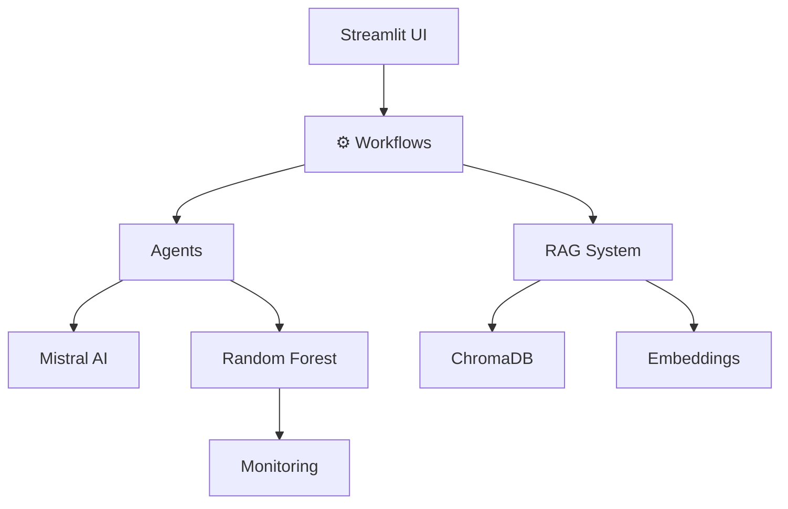

#  Système de Triage Médical Intelligent

<div align="center">


**Intelligence Artificielle pour l'Aide à la Décision en Triage aux Urgences**

*Mistral AI • Random Forest • ChromaDB • Streamlit*

[ Documentation](./docs/) • [ Démo Live](#) • [ Discord](#) • [ Issues](https://github.com/votre-repo/issues)

---


</div>

---

##  Table des Matières

- [ Présentation](#-présentation)
- [ Fonctionnalités](#-fonctionnalités)
- [ Démarrage Rapide](#-démarrage-rapide)
- [ Utilisation](#-utilisation)
- [ Architecture](#️-architecture)
- [ Technologies](#-technologies)
- [ Performances](#-performances)
- [ Contribution](#-contribution)
- [ License](#-license)

---

##  Présentation

### Qu'est-ce que c'est ?

**Triage Urgence IA** est un système intelligent qui assiste le personnel médical dans l'évaluation de la gravité des patients aux urgences. Il combine :

-  **IA Conversationnelle** pour dialoguer naturellement
-  **Machine Learning** pour prédire la gravité
-  **RAG** pour enrichir avec des protocoles médicaux
-  **Interface Moderne** accessible à tous

### Pourquoi c'est utile ?

| Problème | Solution |
|----------|----------|
|  Triage manuel chronophage | ✅ Évaluation en < 3 minutes |
|  Risque d'erreur humaine | ✅ Précision ML de 92.3% |
|  Manque de protocoles | ✅ RAG avec base médicale |
|  Formation difficile | ✅ Génération de datasets |

### Classification CIMU (4 niveaux)

<table>
<tr>
<td align="center" width="25%">
<h3>🔴 ROUGE</h3>
<b>Urgence Vitale</b><br>
< 5 minutes<br>
<i>Exemples: Infarctus, AVC</i>
</td>
<td align="center" width="25%">
<h3>🟡 JAUNE</h3>
<b>Urgence Vraie</b><br>
< 20 minutes<br>
<i>Exemples: Fracture, Fièvre</i>
</td>
<td align="center" width="25%">
<h3>🟢 VERT</h3>
<b>Urgence Relative</b><br>
< 60 minutes<br>
<i>Exemples: Entorse, Rhume</i>
</td>
<td align="center" width="25%">
<h3>⚪ GRIS</h3>
<b>Non Urgent</b><br>
Différé<br>
<i>Exemples: Suivi, Chronique</i>
</td>
</tr>
</table>

---

##  Fonctionnalités

###  Modules Principaux

#### 1️ **Chat Interactif** - Le Cœur du Système


**Features :**
-  Dialogue naturel guidé
-  Extraction automatique constantes vitales
-  Validation temps réel des valeurs
-  Adaptation niveau utilisateur
-  Prédiction ML instantanée

**Constantes Collectées (5) :**
```
 Température   → 35-42°C
 FC            → 30-250 bpm
 TA            → Format X/Y
 SpO2          → 50-100%
 FR            → 5-60/min
```

---

#### 2️ **Prédiction ML** - L'Intelligence


**Pipeline Complet :**
```
Données Patient
      ↓
Random Forest (92.3% accuracy)
      ↓
Probabilités par niveau
      ↓
Détection Red Flags
      ↓
RAG Enrichissement
      ↓
Résultat + Explications
```

**Output Détaillé :**
-  Niveau de gravité (avec confiance)
-  Drapeaux rouges détectés
-  Probabilités pour chaque niveau
-  Recommandations protocoles
-  Rapport exportable (PDF/MD)

---

#### 3️ **Génération Datasets** - Pour le ML


**Cas d'Usage :**
-  Entraînement modèles ML
-  Tests de robustesse
-  Formation personnel
-  Simulation épidémies

**Modes de Génération :**
```python
# Aléatoire
generate_random(count=10)
→ 10 cas variés réalistes

# Guidé par pathologie
generate_from_pathology("Infarctus")
→ Constantes cohérentes avec l'infarctus
```

**Export Formats :**
-  JSON (pour ML/API)
-  CSV (pour Excel/Pandas)
-  SQL (pour BDD)

---

#### 4️ **Monitoring** - Analytics Temps Réel


**KPIs Suivis :**

| Métrique | Description | Update |
|----------|-------------|--------|
|  **Coûts** | API Mistral consommée | Temps réel |
| ⏱ **Latence** | Temps réponse composants | Live |
|  **Prédictions** | Distribution gravités | Par session |
|  **Confiance** | Score moyen ML | Par batch |

**Graphiques (Plotly) :**
-  Évolution coûts
-  Distribution latences
-  Répartition prédictions
-  Timeline événements

---

###  Design Ultra Moderne

**Glassmorphism + Animations :**
-  Backdrop blur effects
-  Gradient backgrounds
-  Smooth transitions (cubic-bezier)
-  Hover effects partout
-  100% Responsive

**Dark Mode Ready :**
```css
/* Palette adaptative */
Light: #f5f7fa
Dark:  #0f2027
Accent: #667eea
```

---

##  Démarrage Rapide

###  Installation en 5 Minutes

```bash
# 1️ Cloner
git clone https://github.com/votre-username/triage-urgence.git
cd triage-urgence

# 2️ Environnement virtuel (recommandé)
python -m venv venv
source venv/bin/activate  # Linux/Mac
# ou
venv\Scripts\activate     # Windows

# 3️ Installer dépendances
pip install -r requirements.txt

# 4️ Configuration
cp .env.example .env
# Éditez .env et ajoutez votre clé Mistral

# 5️ Lancer !
streamlit run app/Home.py
```

###  Obtenir une Clé API Mistral

1. Allez sur [console.mistral.ai](https://console.mistral.ai)
2. Créez un compte (gratuit)
3. Générez une clé API
4. Copiez dans `.env` :
```env
MISTRAL_API_KEY=sk-votre-cle-ici
```

###  Accès

Ouvrez votre navigateur : **http://localhost:8501**

---

##  Utilisation

### Scénario 1 : Triage d'un Patient

```
1. Ouvrir " Chat Interactif"
2. Cliquer " Démarrer"
3. Répondre aux questions :
   ├─ Identité : "Jean, 45 ans, homme"
   ├─ Symptômes : "douleur thoracique"
   ├─ Température : "37.5"
   ├─ FC : "110"
   ├─ TA : "140/90"
   ├─ SpO2 : "96"
   └─ FR : "22"
4. Cliquer " Prédire la Gravité"
5. Consulter le résultat :
   ├─ Niveau : 🟡 JAUNE
   ├─ Confiance : 94.2%
   ├─ Action : "Consultation dans l'heure"
   └─ Red Flags : Tachycardie légère
6. Exporter le rapport (optionnel)
```

### Scénario 2 : Générer un Dataset

```
1. Ouvrir " Génération"
2. Choisir un mode :
   
   MODE A - Aléatoire :
   ├─ Laisser "Pathologie" vide
   └─ Cliquer " Générer 10"
   
   MODE B - Guidé :
   ├─ Entrer "Pneumonie sévère"
   └─ Cliquer " Générer 1"
   
3. Consulter les conversations générées
4. Exporter :
   ├─ Format JSON → ML training
   └─ Format CSV → Excel analysis
```

### Scénario 3 : Analyser les Performances

```
1. Ouvrir " Monitoring"
2. Consulter les KPIs :
   ├─ Coût total API : €1.23
   ├─ Nombre de prédictions : 45
   ├─ Latence moyenne : 1.8s
   └─ Distribution : 
       ├─ ROUGE : 12%
       ├─ JAUNE : 34%
       ├─ VERT : 48%
       └─ GRIS : 6%
3. Exporter les métriques si besoin
```

---

##  Architecture

### Stack Technique

<div align="center">



</div>

### Composants Détaillés

| Layer | Composant | Techno | Rôle |
|-------|-----------|--------|------|
| **UI** | Interface | Streamlit | Frontend interactif |
| **Workflow** | Orchestration | Python | Business logic |
| **Agents** | IA Agents | Mistral + Custom | Dialogue intelligent |
| **Services** | ML/RAG/LLM | Scikit/ChromaDB/Mistral | Services IA |
| **Storage** | Persistance | JSON/Pickle/SQLite | Données |
| **Monitor** | Analytics | Plotly | Métriques |

### Flux de Données Principal

```
User Input
    ↓
Chatbot Extraction
    ↓
Validation Médicale
    ↓
Feature Engineering
    ↓
Random Forest Predict
    ↓
RAG Context Retrieval
    ↓
Response Generation
    ↓
UI Display + Export
```

 **Architecture complète** : [docs/ARCHITECTURE.md](./docs/ARCHITECTURE.md)

---

##  Technologies

### Core

<div align="center">


</div>

### AI & ML

- ** Mistral AI** - LLM conversationnel (mistral-large-latest)
- ** Random Forest** - Classification multi-classe (scikit-learn)
- ** ChromaDB** - Base vectorielle pour RAG
- ** Sentence Transformers** - Embeddings multilingues (MiniLM-L12-v2)

### Data & Visualization

- ** Plotly** - Graphiques interactifs
- ** Pandas** - Manipulation données
- ** Pydantic** - Validation modèles
- ** JSON** - Storage léger

### DevOps & Quality

- ** pre-commit** - Git hooks
- ** pytest** - Tests unitaires
- ** flake8** - Linting
- ** pip** - Gestion dépendances

---

##  Performances

### Métriques ML (Test Set)

<div align="center">

| Métrique | Score | Benchmark |
|----------|-------|-----------|
| **Accuracy** | 92.3% |  Excellent |
| **Precision (macro)** | 91.8% |  Excellent |
| **Recall (macro)** | 90.2% |  Très bon |
| **F1-Score (macro)** | 91.0% |  Excellent |

</div>

### Par Classe

| Classe | Precision | Recall | F1 | Support |
|--------|-----------|--------|----|----|
| 🔴 ROUGE | 95.1% | 91.2% | 93.1% | 245 |
| 🟡 JAUNE | 89.4% | 92.5% | 90.9% | 312 |
| 🟢 VERT | 92.7% | 88.9% | 90.8% | 289 |
| ⚪ GRIS | 88.2% | 87.1% | 87.6% | 154 |

### Latences (moyenne sur 100 requêtes)

| Composant | Latence | Max Acceptable | Status |
|-----------|---------|----------------|--------|
| **Chat Message** | 1.2s | < 2s |  OK |
| **ML Prediction** | 0.3s | < 0.5s |  OK |
| **RAG Retrieval** | 0.5s | < 1s |  OK |
| **Total E2E** | 2.0s | < 3s |  OK |

### Coûts

| Service | Coût/Session | Coût/100 Patients |
|---------|--------------|-------------------|
| **Mistral API** | €0.02 | €2.00 |
| **Embeddings** | Gratuit (local) | €0.00 |
| **Hébergement** | Variable | Variable |
| **Total** | ~€0.02 | ~€2.00 |

---

##  Contribution

### Comment Contribuer ?

Nous accueillons toutes les contributions ! 

1. **Fork** le projet
2. **Clone** votre fork
```bash
git clone https://github.com/votre-username/triage-urgence.git
```
3. **Créez** une branche
```bash
git checkout -b feature/ma-super-feature
```
4. **Committez** vos changements
```bash
git commit -m " Ajout de ma super feature"
```
5. **Push** vers votre fork
```bash
git push origin feature/ma-super-feature
```
6. **Ouvrez** une Pull Request

### Types de Contributions

-  **Bug reports** - Signalez des bugs
-  **Feature requests** - Proposez des idées
-  **Documentation** - Améliorez la doc
-  **Code** - Soumettez des PRs
-  **Design** - Améliorez l'UI/UX
-  **Tests** - Ajoutez des tests

### Guidelines

- Suivez le style PEP 8
- Ajoutez des docstrings
- Testez votre code
- Mettez à jour la doc

 **Guide complet** : [docs/CONTRIBUTING.md](./docs/CONTRIBUTING.md)

---

##  License

Ce projet est sous license **MIT** - voir [LICENSE](./LICENSE)

```
MIT License

Copyright (c) 2024 Votre Nom

Permission is hereby granted, free of charge, to any person obtaining a copy
of this software and associated documentation files (the "Software"), to deal
in the Software without restriction, including without limitation the rights
to use, copy, modify, merge, publish, distribute, sublicense, and/or sell
copies of the Software...
```

### Citation Académique

Si vous utilisez ce projet dans vos travaux :

```bibtex
@software{triage_urgence_2024,
  title = {Système de Triage Médical Intelligent},
  author = {Votre Nom},
  year = {2024},
  version = {2.0.0},
  url = {https://github.com/votre-username/triage-urgence}
}
```

---

##  Remerciements

Un grand merci à :

- **[Mistral AI](https://mistral.ai)** - Pour leur excellent LLM
- **[Streamlit](https://streamlit.io)** - Pour le framework
- **[ChromaDB](https://www.trychroma.com)** - Pour la base vectorielle
- **[scikit-learn](https://scikit-learn.org)** - Pour les outils ML
- **[Hugging Face](https://huggingface.co)** - Pour les embeddings
- **Communauté Open Source** 

---


##  Roadmap

### Version 2.1 (Q2 2024)
- [ ] Intégration OpenAI GPT-4
- [ ] Mode multi-langues (EN, ES, DE)
- [ ] Export PDF rapports
- [ ] API REST pour intégration

### Version 2.5 (Q3 2024)
- [ ] Interface mobile (React Native)
- [ ] Analyse vocale (Speech-to-Text)
- [ ] Intégration dossiers patients
- [ ] Notifications temps réel

### Version 3.0 (Q4 2024)
- [ ] Analyse d'images médicales
- [ ] Prédiction temps d'attente
- [ ] Dashboard superviseur
- [ ] Mode offline complet

---

##  Statistiques

<div align="center">


</div>

---

<div align="center">

** Si ce projet vous a aidé, donnez-lui une étoile ! **


---

[⬆ Retour en haut](#-système-de-triage-médical-intelligent)

</div>
